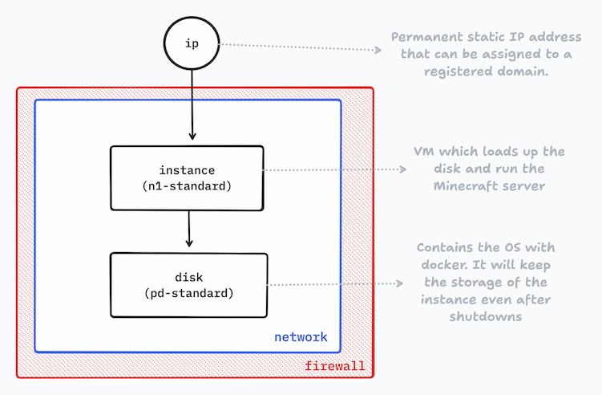

# pickaxe ⛏️
Deployable Minecraft server with Pulumi on Google Cloud.


This is the infrastructure-as-code (IaC) that I use to create a **on-demand, small, and cheap Minecraft server to play with friends**. The server can be shutdown and the server data will be kept in a disk and can be later restored in a new instance. That way, your instance does not need to be always running and the infrascture cost can be drastically reduced. It also deploys in a [preemptible](https://cloud.google.com/compute/docs/instances/preemptible), so you don't need to worry about forgeting the instance running since it will shutdown after 24h.

It uses [Pulumi](https://www.pulumi.com/) as the IaC framework to deploy de server infrastructure on Google Cloud. Inspired by [Futurice's Terraform recipe](https://futurice.com/blog/friends-and-family-minecraft-server-terraform-recipe).

## Architecture



- **IP**: represents an Address resource. To communicate with the Internet and instances outside of the same network, you must specify the instance’s external IP address. In this case, is a static IP address to access the Minecraft server.
- **Network**: represents a [VPC network](https://www.pulumi.com/registry/packages/gcp/api-docs/compute/address/) to conect the multiple resources of the infrastructure.
- **Firewall**: represents [Firewall Rule](https://www.pulumi.com/registry/packages/gcp/api-docs/compute/firewall/)  resource. Firewall rules allow or deny ingress traffic to, and egress traffic from your instances. Allow access to the Minecraft server port.
- **Disk**: represents a [Persistent Disk](https://www.pulumi.com/registry/packages/gcp/api-docs/compute/disk/) resource. Persistent disks are durable storage devices that function similarly to the physical disks in a desktop or a server. Persistent disks are located independently from your virtual machine instances, so you can detach or move persistent disks to keep your data even after you delete your instances. It uses the [cos-stable](https://cloud.google.com/container-optimized-os/docs) image, so it has docker installed on it to run a [`itzg/minecraft-server`](https://github.com/itzg/docker-minecraft-server) container.
- **Instance**: represents a [VM instance](https://www.pulumi.com/registry/packages/gcp/api-docs/compute/instance/). It will attach to the disk resource to run the Minecraft server, connect to the VPC and use the Address resource as its external IP to be accessed through the internet.

The external IP address resource can be later registered in a domain to be easily accessed by the server players.

## Usage

1. Make sure you have Pulumi installed and configured.
2. Create an empty directory where you want to place the server infrastrcuture.
3. In this directory, run:
```bash
pulumi new https://github.com/paulopacitti/pickaxe
```

